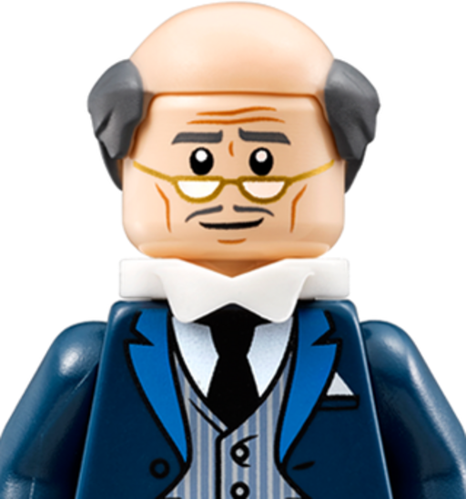

<div align="center">
  <h1 style="margin: 0">Edwin</h1>

  

  <br />
  <strong>A smart display with some nifty plugins.</strong>
  
  <p>🎵 🖼️ 🕓 📡</p>
  <br/>

  <a href="https://angular.io">
    
  </a>
  <a href="https://nestjs.com">
    
  </a>
  <a href="https://nodejs.org">
    
  </a>
  <a href="https://nx.dev">
    
  </a>
  <a href="https://www.typescriptlang.org">
    
  </a>
</div>

## Installation

```bash
# 🐑 Clone the repository from GitHub
git clone https://github.com/psweeney101/edwin

# 🏗 Install dependencies
cd edwin
npm install
```

## Setup
Create a .env file
```bash
# Core
PORT=3000
API_URL="http://localhost:3000"
UI_URL="http://localhost:4200"
UI_DIST_PATH="/path/to/edwin/dist/apps/ui"

# Jukebox
SPOTIFY_CLIENT_ID="spotify-client-id"
SPOTIFY_CLIENT_SECRET="spotify-client-password"
SPOTIFY_REFRESH_TOKEN="spotify-refresh-token"

# Photos
PHOTOS_PATH="/path/to/photos"

# WiFi
WIFI_SSID="wifi-ssid"
WIFI_PASSWORD="wifi-password"
WIFI_SECURITY="wifi-security"
```

## Usage

```bash
# 🎬 Start Edwin
npm start
```

```bash
# 🕵️‍♂️ Lint Edwin
npm run lint
npm run lint:fix
```

```bash
# 👨‍🏫 Test Edwin
npm run test
npm run test:watch
```

```bash
# 🛠 Build Edwin
npm run build
```

## Contributing
```bash
# 👨‍💻 Generate a new Edwin Plugin
nx workspace-generator plugin <plugin> [--ui] [--api] [--shared]
```

## License

[MIT](LICENSE)
